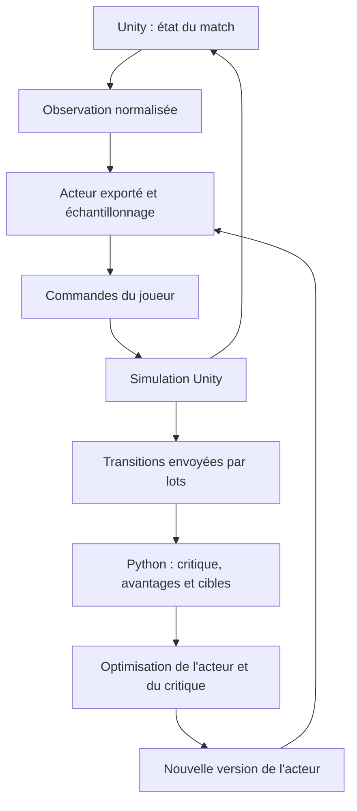

# Comprendre l'implémentation PPO du projet

Ce document explique les réseaux déjà écrits dans [ppo_network.py](src/football_rl/ppo_network.py), leur futur rôle dans Unity et les étapes nécessaires à un entraînement PPO complet. Il complète le [README du projet](README.md).

**État actuel : un critique et une politique de déplacement sont implémentés.** Le saut, la frappe, le tacle optionnel, le buffer, les avantages, les pertes PPO, les optimiseurs et l'export vers Unity restent à construire. Les vérifications actuelles portent sur les calculs des réseaux ; aucun apprentissage du football n'est encore réalisé.

## 1. Acteur, politique et critique

Un MLP est un réseau de neurones composé de couches entièrement connectées et d'activations non linéaires. Les deux MLP du projet reçoivent la même observation, mais apprennent des fonctions différentes.

| Élément | Fonction | Sortie actuelle | Utilisation prévue |
| --- | --- | --- | --- |
| Acteur, `PPOActorNetwork` | Décrire comment choisir une action selon l'observation | Trois moyennes et trois log-écarts-types | Exécution du joueur dans Unity, apprentissage dans Python |
| Politique, $\pi_\theta$ | Définir la distribution des actions | Distribution construite avec les sorties de l'acteur et leurs transformations | Échantillonnage des décisions et calcul de leur log-probabilité |
| Critique, `PPOValueNetwork` | Estimer le retour futur attendu depuis une observation | Une valeur réelle $V_\phi(s)$ | Calcul des avantages et apprentissage de la valeur dans Python |

L'acteur et la politique ne sont pas deux réseaux supplémentaires à entraîner : l'acteur paramètre la politique. Le critique fournit une estimation utile à l'apprentissage ; ce sont les pertes et les optimiseurs qui modifieront les poids de chacun des deux réseaux.

La valeur prédite par le critique est l'espérance de la somme des récompenses futures actualisées, sous la politique suivie :

$$
V^\pi(s_t)=\mathbb E_\pi\left[\sum_{k=0}^{T-t-1}\gamma^k r_{t+k}\mid s_t\right].
$$

$s_t$ désigne ici l'observation, $r_t$ la récompense de la transition et $\gamma$ l'importance accordée au futur. Cette valeur peut être négative ou dépasser 1. Elle n'est pas une probabilité de victoire. La fonction de valeur sert de référence pour estimer si une action a conduit à un résultat meilleur ou moins bon que prévu. [Principe des méthodes de gradient de politique avec critique](https://spinningup.openai.com/en/latest/algorithms/vpg.html)

## 2. Boucle Unity / Python prévue

1. Python prépare une version de l'acteur et l'envoie à Unity dans un format d'export restant à choisir.
2. Unity construit les observations, exécute cet acteur et échantillonne les commandes.
3. Unity applique les commandes, simule le match et enregistre les transitions dans leur ordre temporel.
4. Unity transmet un lot de trajectoires à Python.
5. Python utilise le critique et les récompenses pour construire les avantages et les cibles de valeur.
6. PPO met à jour l'acteur ; une perte de valeur entraîne le critique.
7. Python renvoie une nouvelle version de l'acteur, puis une nouvelle collecte commence.



La collecte utilisera une version fixe de la politique pendant chaque lot. Elle peut contenir plusieurs parties ou des segments de trajectoires ; il n'est pas nécessaire d'attendre un très grand nombre de matchs complets. La taille du lot reste à choisir.

Le critique peut rester dans Python : les valeurs nécessaires seront calculées avec ses poids gelés avant les mises à jour du lot. L'exécution des commandes dans Unity nécessite l'acteur et ses règles d'échantillonnage. Le pont, la sérialisation et l'export ne sont pas encore implémentés.

Exporter le MLP seul ne suffit pas à reproduire la politique : Unity devra aussi reproduire l'ordre des observations, la normalisation, les bornes des log-écarts-types, le tirage gaussien et `tanh`. Pendant la collecte PPO, utiliser seulement les moyennes produirait un comportement différent de celui dont Python calcule les log-probabilités.

## 3. Des observations réelles aux entrées des réseaux

La taille d'entrée est définie par `ObservationLayout` dans [types.py](src/football_rl/types.py) :

$$
D=22+7(N_{\text{coéquipiers max}}+N_{\text{adversaires max}}).
$$

Pour une capacité allant jusqu'au 3v3, deux coéquipiers et trois adversaires donnent $D=57$. Cette capacité reste fixe pendant les phases 1v1 et en équipe.

| Indices, à partir de zéro, pour cette capacité | Contenu | Nombre de valeurs |
| --- | --- | ---: |
| 0 à 5 | Position relative du ballon, puis vélocité 3D | 6 |
| 6 à 8 | Vélocité 3D du joueur contrôlé | 3 |
| 9 à 22 | Deux emplacements de coéquipiers | 14 |
| 23 à 43 | Trois emplacements d'adversaires | 21 |
| 44 à 48 | Centre relatif, largeur et hauteur du but adverse | 5 |
| 49 à 53 | Centre relatif, largeur et hauteur du but défendu | 5 |
| 54 à 56 | Temps et deux scores | 3 |

Chaque emplacement de joueur contient sa position relative (3), sa vitesse (3) et sa présence (1). Les valeurs d'un joueur absent sont nulles. Le MLP devra apprendre à exploiter la présence ; `nn.Linear` n'applique pas automatiquement un masque particulier.

Le repère est centré sur le joueur, avec des axes parallèles à ceux du terrain et un axe vertical $y$. Les observations sont normalisées dans des bornes partagées avec Unity. Le module `ppo_network.py` reçoit le vecteur déjà préparé ; il ne réalise pas cette préparation.

### Exemple d'encodage

Les positions et échelles de cet exemple sont illustratives, sans imposer de réglages au jeu.

- Joueur : position $(10,0,5)$, vitesse $(0,0,2)$.
- Ballon : position $(14,1,11)$, vitesse $(-1,0,-2)$.
- Échelle choisie pour l'exemple : 20 unités pour les positions relatives et 10 pour les vitesses.

La position relative du ballon vaut $(4,1,6)$. Le début du vecteur devient :

| Bloc | Valeurs normalisées de l'exemple |
| --- | --- |
| Position relative du ballon | $(0{,}20,0{,}05,0{,}30)$ |
| Vitesse du ballon | $(-0{,}10,0,-0{,}20)$ |
| Vitesse du joueur | $(0,0,0{,}20)$ |

Les blocs des autres joueurs, des buts et du match complètent ensuite les 57 valeurs. Les dimensions intérieures des buts indiquent l'ouverture à atteindre ; elles ne déclenchent pas un calcul automatique de visée. Leur utilité sera apprise à partir des expériences.

Les réseaux prennent un lot de forme $(B,D)$ : $B=1$ pour une observation, $B=8$ pour huit situations. Les lignes sont traitées avec les mêmes poids. Les données produites par `torch.randn` dans la démonstration servent à vérifier les calculs ; elles ne représentent pas des matchs cohérents.

## 4. Fonctionnement du code déjà écrit

### Critique

`PPOValueNetwork` applique deux couches de 128 neurones avec activations `Tanh`, puis une couche linéaire à une sortie :

$$
(B,D)\rightarrow(B,128)\rightarrow(B,128)\rightarrow(B,1)\rightarrow(B).
$$

La dernière transformation est `squeeze(-1)`, qui préserve la dimension du lot même quand $B=1$. Le résultat est accessible sous la clé `value`. Les poids de ce réseau sont distincts de ceux de l'acteur.

### Acteur de déplacement

`PPOActorNetwork` possède un tronc de deux couches de 128 neurones avec `Tanh`, suivi de deux têtes linéaires. `forward` retourne :

| Clé | Forme | Signification |
| --- | --- | --- |
| `mean` | $(B,3)$ | Moyennes $\mu$ des coordonnées avant transformation |
| `log_std` | $(B,3)$ | Logarithmes des écarts-types |

`sample_move` borne les log-écarts-types entre -5 et 2, puis calcule $\sigma=\exp(\log\sigma)$. Les bornes constituent un choix initial de stabilité numérique, à conserver identique dans tous les chemins d'exécution. Il échantillonne ensuite :

$$
u_i\sim\mathcal N(\mu_i,\sigma_i^2),\qquad a_i=\tanh(u_i).
$$

`Normal` attend l'écart-type comme paramètre `scale`. `sample()` produit un échantillon sans chemin de gradient à travers le tirage. La future mise à jour PPO recalculera la log-probabilité de cette action maintenue fixe. [Distributions PyTorch](https://docs.pytorch.org/docs/2.14/distributions.html)

Les trois coordonnées sont indépendantes conditionnellement à l'observation. Une même observation produit les mêmes paramètres avec les mêmes poids, mais peut donner plusieurs échantillons. Un écart-type plus grand disperse les valeurs brutes ; après `tanh`, des valeurs extrêmes se concentrent près des bornes. La moyenne avant `tanh` n'est pas nécessairement la moyenne des actions finales.

### Exemple d'action et interprétation Unity

Un déplacement brut d'environ $(0{,}31,0,0{,}55)$ donne une cible normalisée proche de $(0{,}30,0,0{,}50)$.

Avec une échelle d'action illustrative de 10 unités, Unity convertirait cette cible en un décalage $(3,0,5)$. Depuis le joueur en $(10,0,5)$, cela donnerait une cible en $(13,0,10)$, proche du ballon de l'exemple.

Le contrôleur Unity ferait avancer le joueur vers cette cible selon les règles du jeu, sa vitesse et ses collisions. Il ne s'agit pas d'une téléportation. L'échelle et la règle de déplacement effectives restent à convenir.

| Commande du contrat complet | Sens | État de l'acteur actuel |
| --- | --- | --- |
| `move_target` | Cible relative normalisée, trois coordonnées | Implémentée |
| `shoot` | Intensité unique entre 0 et 1 pour tirer ou passer ; zéro pour attendre | À construire |
| `jump` | Demande de saut, zéro ou un | Prochaine étape |
| `tackle` | Demande de tacle optionnel | À construire si activé |

Les commandes pourront être simultanées selon les règles Unity. La direction de frappe dépendra du placement. L'intensité ne comportera aucun seuil distinguant automatiquement une passe d'un tir. `sample_move` ne produit donc pas encore une `FootballAction` complète.

### Log-probabilité du déplacement

Le nom `log_prob` désigne ici une log-densité continue, qui peut être positive. Elle décrit la densité attribuée à une action, pas la qualité de cette action.

Le changement de variable $a=\tanh(u)$ impose :

$$
\log\pi(a\mid s)=\sum_{i=1}^{3}\left[\log p(u_i\mid s)-\log(1-\tanh^2(u_i))\right].
$$

Le code calcule la gaussienne sur `raw_move`, puis utilise l'identité stable :

$$
\log(1-\tanh^2(u))=2\left(\log 2-u-\operatorname{softplus}(-2u)\right).
$$

Cette écriture évite le logarithme d'une différence arrondie à zéro près de la saturation. `softplus` provient de `torch.nn.functional`. [Fonction softplus](https://docs.pytorch.org/docs/2.14/generated/torch.nn.functional.softplus.html)

`sample_move` retourne `raw_move` et `move_target` de forme $(B,3)$, ainsi que `log_prob` de forme $(B,)$. La somme porte sur les coordonnées, pas sur le lot.

`evaluate_move` reçoit des observations et des déplacements bruts enregistrés. Il recalcule leur log-densité avec les poids actuels, sans nouveau tirage et sans calcul d'entropie. Les actions doivent rester détachées du graphe de collecte, tandis que la nouvelle log-probabilité doit rester reliée aux poids à entraîner.

## 5. PPO-Clip : objectif et calculs à implémenter

PPO est **model-free** : il n'apprend pas un modèle des transitions physiques. Il est **on-policy** : chaque phase d'amélioration repose sur une collecte récente sous une politique connue. C'est une méthode de **gradient de politique** : elle ajuste directement les paramètres de la distribution des actions. Notre version sera **actor-critic**, avec une politique explicite et une estimation de valeur.

L'objectif de base est de maximiser le retour attendu :

$$
J(\theta)=\mathbb E_{\pi_\theta}\left[\sum_t\gamma^t r_t\right].
$$

Les récompenses viendront des événements et règles du projet. Leurs coefficients ne sont pas fixés par ce document. PPO permet plusieurs passages sur un même lot récent avant une nouvelle collecte. [Publication PPO](https://arxiv.org/abs/1707.06347)

### Avantage et GAE

L'avantage estime si une action a produit un résultat meilleur ou moins bon que prévu. Un avantage positif favorise sa probabilité ; un avantage négatif encourage à la réduire. Une récompense immédiate positive peut néanmoins correspondre à un avantage négatif si la suite est décevante.

Avec les valeurs calculées avant les mises à jour, on construira :

$$
\delta_t=r_t+\gamma b_tV_{\mathrm{old}}(s_{t+1})-V_{\mathrm{old}}(s_t),
$$

$$
\hat A_t=\delta_t+\gamma\lambda c_t\hat A_{t+1}.
$$

La récurrence GAE se calcule à rebours. $\lambda$ règle la profondeur de combinaison des erreurs et le compromis entre biais et variance. $b_t$ autorise une estimation de valeur future ; $c_t$ autorise la continuation de la récursion dans la trajectoire. La cible de valeur proposée est $\hat R_t=\hat A_t+V_{\mathrm{old}}(s_t)$, calculée avant de normaliser éventuellement les avantages destinés à l'acteur. [Publication GAE](https://arxiv.org/abs/1506.02438)

| Situation | $b_t$ | $c_t$ |
| --- | ---: | ---: |
| Transition ordinaire avec une suite dans le segment | 1 | 1 |
| Véritable fin de match | 0 | 0 |
| Coupure technique avec reset | 1 | 0 |
| Fin du segment disponible, match encore en cours | 1 | 0 |

Lors d'une coupure technique, la valeur future utilise l'observation finale avant le reset. La récursion ne traverse jamais la frontière vers un nouveau match. La fin normale du chrono peut constituer une terminaison du problème ; `max_steps` utilisé uniquement pour couper la collecte est une troncature. [Terminaisons et limites de temps](https://gymnasium.farama.org/tutorials/gymnasium_basics/handling_time_limits/)

### Ratio, clipping et pertes

Pour une action enregistrée, PPO compare la nouvelle politique à celle qui a joué :

$$
\rho_t=\exp\left(\log\pi_\theta(a_t\mid s_t)-\log\pi_{\mathrm{old}}(a_t\mid s_t)\right).
$$

Le terme à maximiser est :

$$
L^{\mathrm{clip}}=\mathbb E_t\left[\min\left(\rho_t\hat A_t,\operatorname{clip}(\rho_t,1-\epsilon,1+\epsilon)\hat A_t\right)\right].
$$

Le clipping retire l'incitation à augmenter trop fortement la probabilité d'une bonne action ou à diminuer trop fortement celle d'une mauvaise action. Il ne borne pas directement les changements de poids et ne garantit pas une amélioration. Une surveillance de la divergence KL pourra interrompre les mises à jour du lot.

L'acteur minimisera $-L^{\mathrm{clip}}$, avec éventuellement un bonus d'entropie. Le critique minimisera une erreur quadratique $\mathbb E[(V_\phi(s_t)-\hat R_t)^2]$. Les réseaux séparés pourront utiliser deux optimiseurs. [Équations et explication de PPO-Clip](https://spinningup.openai.com/en/latest/algorithms/ppo.html)

Exemple numérique : si les log-densités d'un déplacement passent de -2 à -1,8, le ratio vaut environ 1,22. Avec un avantage de 0,4 et un $\epsilon$ illustratif de 0,2, le terme non clippé vaut environ 0,488, le terme clippé 0,48. Le minimum conserve 0,48. Une log-probabilité croissante ne signifie donc pas, seule, que l'action est bonne : l'avantage fournit ce signal.

Les anciennes log-probabilités, les anciennes valeurs, les avantages et les cibles restent fixes pendant les passages sur le lot. L'ordre temporel sert à calculer GAE avant de mélanger les transitions en mini-lots. Le nombre de passages, la taille du lot, $\gamma$, $\lambda$, $\epsilon$ et les taux d'apprentissage restent à choisir ; aucun n'est encore implémenté dans une boucle PPO.

## 6. Données à convenir avec l'équipe Unity

`Transition` contient déjà observation, action, récompense, observation suivante, `terminated` et `truncated`. Pour PPO, il faudra compléter la collecte ou conserver des métadonnées associées :

| Donnée | Utilité |
| --- | --- |
| Version de politique | Identifier les poids qui ont produit le lot |
| Identité du joueur, du match et ordre des décisions | Reconstituer les trajectoires sans mélanger les agents |
| `raw_move` | Réévaluer le déplacement malgré la saturation de `tanh` |
| Ancienne log-probabilité | Former le ratio PPO |
| Observation finale avant reset | Calculer la valeur future lors d'une troncature |
| Convention de normalisation et cadence des décisions | Reproduire les mêmes entrées et la même notion de pas temporel |

Les métadonnées propres à PPO ne sont pas encore définies dans `Transition`. Son champ `next_observation` pourra contenir l'observation finale avant reset ; cette convention devra être respectée par le pont. Les anciennes log-probabilités peuvent être transmises par Unity ou recalculées en Python avec une copie gelée de l'acteur, si les données permettent de reproduire exactement sa distribution. Les valeurs du critique peuvent être calculées en Python avant l'optimisation du lot.

Le buffer conservera les actions, anciennes log-probabilités et valeurs sans graphe Autograd. `sample()` ne détache pas automatiquement toutes les autres sorties de la méthode : `log_prob` reste différentiable si Autograd est actif. La collecte utilisera donc `torch.no_grad()` ou un détachement explicite ; l'évaluation pendant l'apprentissage activera les gradients vers les poids courants.

Lorsque toutes les commandes seront disponibles, PPO utilisera la log-probabilité de l'action complète. Avec une factorisation conditionnelle, elle sera la somme des contributions du déplacement, de la frappe et des commandes binaires. Le `log_prob` actuel ne couvre que le déplacement.

Les actions enregistrées doivent correspondre aux commandes soumises à Unity. Les règles de contact, de saut et de frappe peuvent limiter leur effet physique ; une correction ou transformation supplémentaire des commandes doit être définie de façon cohérente dans la chaîne.

## 7. Vérifications disponibles et limites

Dans l'environnement Python du projet, lancer depuis la racine :

```powershell
python -m football_rl.ppo_network
```

Le bloc de démonstration vérifie les formes des log-probabilités pour un lot de huit et un lot de un, la finitude sur le lot de huit, la proximité entre échantillonnage et réévaluation, une valeur de référence et la présence de gradients dans les deux têtes. Les résultats aléatoires changent d'une exécution à l'autre. `allclose` compare avec une tolérance.

Le cas de référence est une gaussienne standard sur trois coordonnées, évaluée en $(0,0,0)$. La correction est nulle et la log-densité vaut $-\frac32\log(2\pi)\approx-2{,}7568$.

La perte négative moyenne utilisée dans la démonstration sert uniquement à examiner les gradients. `backward()` les calcule sans mettre à jour les poids. Le bloc ne réalise ni optimisation PPO, ni mesure d'une stratégie de football.

`Football3DEnv` contient actuellement un fonctionnement factice : observations aléatoires, actions sans effet et récompenses nulles. Il permet des vérifications d'interface ; les performances d'apprentissage devront être évaluées sur une tâche où les actions ont des conséquences, puis dans Unity.

## 8. Prochaine étape et travail restant

La prochaine étape pédagogique est la tête de saut : un logit issu du tronc de l'acteur, une distribution de Bernoulli, puis des méthodes d'échantillonnage et de réévaluation. Aucun code de saut n'est ajouté à ce stade.

La suite prévue est :

1. Ajouter `jump`, puis `shoot` avec la possibilité explicite de produire zéro, et le tacle si retenu.
2. Assembler la distribution et la log-probabilité de l'action complète.
3. Construire le buffer de collecte, GAE et les cibles du critique.
4. Implémenter les pertes, les optimiseurs et les mini-lots PPO.
5. Suivre les récompenses, résultats de match, pertes, entropie et divergence KL dans TensorBoard.
6. Compléter le contrat de collecte, l'export et l'exécution dans Unity.

Le choix d'une distribution d'intensité doit traiter l'absence de frappe : une distribution continue ordinaire ne produit presque jamais exactement zéro. La politique gardera néanmoins une seule commande externe `shoot` pour tirer et passer.

L'entraînement initial pourra utiliser un adversaire fixe pour distinguer les problèmes de PPO de ceux liés à des adversaires qui apprennent simultanément. Les résultats seront ensuite évalués sur plusieurs matchs et plusieurs initialisations, avec les mêmes règles de jeu et d'observation.
